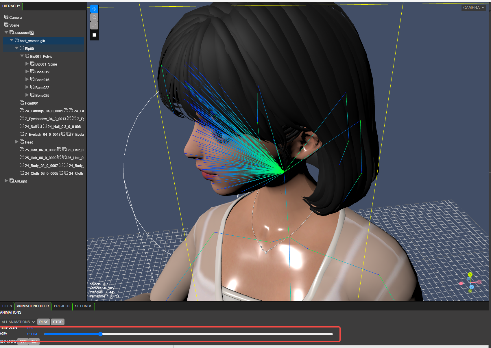

# 骨骼动画编辑器

点击模型，可以显示模型骨骼

.png>)

上图中蓝绿色线条为任务骨骼

双击左侧节点树，可以看到骨骼编号以及名称，可以在骨骼中添加脚本和挂载特效

.png>)

点击下方的ANIMATIONEDITOR页面，可以进入简易动画编辑器

.png>)

帧数后面的时间轴可以自由拖动，模拟动画运行

在拆分帧表格中，填入起始帧和结束帧，可以生成指定的动画切片，然后点击保存即可保存改数据给程序调用，程序调用依赖动画命名。动画命名规则为一般命名规则(英文)

.png>)

在事件触发表格中，策划可以配置动作开始一段时间后，触发的事件，事件名为一般命名规则(英文)，事件表中的第一列动画，会自动识别拆分表中拆分出来的动画命名，无需手动输入，下拉框选择即可。

其中事件为引擎提供的事件类型，例如播放音乐，播放特效

.png>)

编辑后点击保存即可
